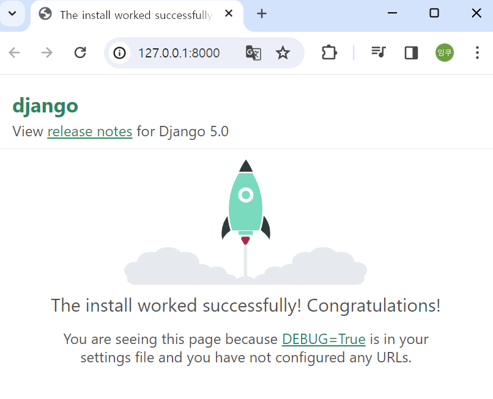

[깃링크](https://github.com/andyjud/django-starter-assets)  
[유튜브](https://www.youtube.com/watch?v=SQ4A7Q6_md8)  

OS : windows11  
Terminal : bash shell  


---  

# 1. 초기세팅    

- 가상환경 만들기  
  
  &darr; `/` &darr; `bash shell`
  ```bash  
  python -m venv .venv  
  ```  

<br>  

- 가상환경 진입 파일만들기  
  
  &darr; `/` &darr; `bash shell`
  ```bash
  echo ". '.venv/Scripts/activate'" > v
  ```  

  <br>

- 위 명령어 실행 후 ". v" 명령어로 가상환경 진입.  
  
  &darr; `/` &darr; `bash shell`
  ```bash
  . v
  ```  

  <br>

- 패키지 설치를 위한 requirements.txt 만들기  

  &darr; `/` &darr; `bash shell`
  ```bash
  touch requirements.txt
  ```

  <br>

- 설치할 패키지 requirements.txt 에 입력하기  

  &darr; `/` &darr; `requirements.txt`
  ```txt
  Django
  pillow
  django-cleanup
  django-allauth
  django-htmx
  ```

  <br>
  
- 가상환경에 패키지 설치하기  

  &darr; `/` &darr; `bash shell`
  ```bash
  pip install -r requirements.txt
  ```

  <br>

- pip 업그레이드 하기  

  &darr; `/` &darr; `bash shell`
  ```bash
  pip install --upgrade pip
  ```

  <br>

- `.gitignore` 파일 만들기  
  - 깃허브에 업로드시 업로드 필요없는 파일 제외하기 위한 파일작성  
  - `.gitignore` 파일생성
    
    &darr; `/` &darr; `bash shell`
    ```bash  
    touch .gitignore
    ```

  - 가상환경 진입을 위해 생성한 `v` 파일과 가상환경 파일 `.venv` 폴더 그리고 나머지 장고관련 파일은 **[gitignore.io](https://www.toptal.com/developers/gitignore)** 사이트에서 "django" 검색해서 나오는 내용 넣기. (아래 내용으로 넣으면 됨)  

    &darr; `/` &darr; `.gitignore`
    ```txt
    v
    # Created by https://www.toptal.com/developers/gitignore/api/django
    # Edit at https://www.toptal.com/developers/gitignore?templates=django

    ### Django ###
    *.log
    *.pot
    *.pyc
    __pycache__/
    local_settings.py
    db.sqlite3
    db.sqlite3-journal
    media

    # If your build process includes running collectstatic, then you probably don't need or want to include staticfiles/
    # in your Git repository. Update and uncomment the following line accordingly.
    # <django-project-name>/staticfiles/

    ### Django.Python Stack ###
    # Byte-compiled / optimized / DLL files
    *.py[cod]
    *$py.class

    # C extensions
    *.so

    # Distribution / packaging
    .Python
    build/
    develop-eggs/
    dist/
    downloads/
    eggs/
    .eggs/
    lib/
    lib64/
    parts/
    sdist/
    var/
    wheels/
    share/python-wheels/
    *.egg-info/
    .installed.cfg
    *.egg
    MANIFEST

    # PyInstaller
    #  Usually these files are written by a python script from a template
    #  before PyInstaller builds the exe, so as to inject date/other infos into it.
    *.manifest
    *.spec

    # Installer logs
    pip-log.txt
    pip-delete-this-directory.txt

    # Unit test / coverage reports
    htmlcov/
    .tox/
    .nox/
    .coverage
    .coverage.*
    .cache
    nosetests.xml
    coverage.xml
    *.cover
    *.py,cover
    .hypothesis/
    .pytest_cache/
    cover/

    # Translations
    *.mo

    # Django stuff:

    # Flask stuff:
    instance/
    .webassets-cache

    # Scrapy stuff:
    .scrapy

    # Sphinx documentation
    docs/_build/

    # PyBuilder
    .pybuilder/
    target/

    # Jupyter Notebook
    .ipynb_checkpoints

    # IPython
    profile_default/
    ipython_config.py

    # pyenv
    #   For a library or package, you might want to ignore these files since the code is
    #   intended to run in multiple environments; otherwise, check them in:
    # .python-version

    # pipenv
    #   According to pypa/pipenv#598, it is recommended to include Pipfile.lock in version control.
    #   However, in case of collaboration, if having platform-specific dependencies or dependencies
    #   having no cross-platform support, pipenv may install dependencies that don't work, or not
    #   install all needed dependencies.
    #Pipfile.lock

    # poetry
    #   Similar to Pipfile.lock, it is generally recommended to include poetry.lock in version control.
    #   This is especially recommended for binary packages to ensure reproducibility, and is more
    #   commonly ignored for libraries.
    #   https://python-poetry.org/docs/basic-usage/#commit-your-poetrylock-file-to-version-control
    #poetry.lock

    # pdm
    #   Similar to Pipfile.lock, it is generally recommended to include pdm.lock in version control.
    #pdm.lock
    #   pdm stores project-wide configurations in .pdm.toml, but it is recommended to not include it
    #   in version control.
    #   https://pdm.fming.dev/#use-with-ide
    .pdm.toml

    # PEP 582; used by e.g. github.com/David-OConnor/pyflow and github.com/pdm-project/pdm
    __pypackages__/

    # Celery stuff
    celerybeat-schedule
    celerybeat.pid

    # SageMath parsed files
    *.sage.py

    # Environments
    .env
    .venv
    env/
    venv/
    ENV/
    env.bak/
    venv.bak/

    # Spyder project settings
    .spyderproject
    .spyproject

    # Rope project settings
    .ropeproject

    # mkdocs documentation
    /site

    # mypy
    .mypy_cache/
    .dmypy.json
    dmypy.json

    # Pyre type checker
    .pyre/

    # pytype static type analyzer
    .pytype/

    # Cython debug symbols
    cython_debug/

    # PyCharm
    #  JetBrains specific template is maintained in a separate JetBrains.gitignore that can
    #  be found at https://github.com/github/gitignore/blob/main/Global/JetBrains.gitignore
    #  and can be added to the global gitignore or merged into this file.  For a more nuclear
    #  option (not recommended) you can uncomment the following to ignore the entire idea folder.
    #.idea/

    # End of https://www.toptal.com/developers/gitignore/api/django
    

    ```  

<br>  

---  

# 2. 장고 설정  

- 장고 설치하기  
  
  &darr; `/` &darr; `bash shell`
  ```bash
  django-admin startproject a_core .
  ```

  <br>

- 데이터 베이스 셋업하기    
  
  &darr; `/` &darr; `bash shell`
  ```bash
  python manage.py migrate
  ```
  

  <br>

- 장고 서버 정상작동 확인하기  
  
  &darr; `/` &darr; `bash shell`
  ```bash
  python manage.py runserver
  ```
    
    

  <br>

- 장고앱 'a_home' 설치하기  
  
  &darr; `/` &darr; `bash shell`
  ```bash
  python manage.py startapp a_home
  ```

  <br>
 
- `a_home`를 INSTALLED_APPS에 추가하기  
  
  &darr; `a_core/` &darr; `settings.py`
  ```python
  INSTALLED_APPS = [
      ...
      'a_home',
  ]
  ```
  ```diff
  """
  Django settings for a_core project.

  Generated by 'django-admin startproject' using Django 5.0.3.

  For more information on this file, see
  https://docs.djangoproject.com/en/5.0/topics/settings/

  For the full list of settings and their values, see
  https://docs.djangoproject.com/en/5.0/ref/settings/
  """

  from pathlib import Path

  # Build paths inside the project like this: BASE_DIR / 'subdir'.
  BASE_DIR = Path(__file__).resolve().parent.parent


  # Quick-start development settings - unsuitable for production
  # See https://docs.djangoproject.com/en/5.0/howto/deployment/checklist/

  # SECURITY WARNING: keep the secret key used in production secret!
  SECRET_KEY = 'django-insecure-915ypag@#aq+o%&b9sq!00mzmp&s31mo3u#e#v#6e)p*%hu3eq'

  # SECURITY WARNING: don't run with debug turned on in production!
  DEBUG = True

  ALLOWED_HOSTS = []


  # Application definition

  INSTALLED_APPS = [
      'django.contrib.admin',
      'django.contrib.auth',
      'django.contrib.contenttypes',
      'django.contrib.sessions',
      'django.contrib.messages',
      'django.contrib.staticfiles',
  +   'a_home',
  ]

  MIDDLEWARE = [
      'django.middleware.security.SecurityMiddleware',
      'django.contrib.sessions.middleware.SessionMiddleware',
      'django.middleware.common.CommonMiddleware',
      'django.middleware.csrf.CsrfViewMiddleware',
      'django.contrib.auth.middleware.AuthenticationMiddleware',
      'django.contrib.messages.middleware.MessageMiddleware',
      'django.middleware.clickjacking.XFrameOptionsMiddleware',
  ]

  ROOT_URLCONF = 'a_core.urls'

  TEMPLATES = [
      {
          'BACKEND': 'django.template.backends.django.DjangoTemplates',
          'DIRS': [],
          'APP_DIRS': True,
          'OPTIONS': {
              'context_processors': [
                  'django.template.context_processors.debug',
                  'django.template.context_processors.request',
                  'django.contrib.auth.context_processors.auth',
                  'django.contrib.messages.context_processors.messages',
              ],
          },
      },
  ]

  WSGI_APPLICATION = 'a_core.wsgi.application'


  # Database
  # https://docs.djangoproject.com/en/5.0/ref/settings/#databases

  DATABASES = {
      'default': {
          'ENGINE': 'django.db.backends.sqlite3',
          'NAME': BASE_DIR / 'db.sqlite3',
      }
  }


  # Password validation
  # https://docs.djangoproject.com/en/5.0/ref/settings/#auth-password-validators

  AUTH_PASSWORD_VALIDATORS = [
      {
          'NAME': 'django.contrib.auth.password_validation.UserAttributeSimilarityValidator',
      },
      {
          'NAME': 'django.contrib.auth.password_validation.MinimumLengthValidator',
      },
      {
          'NAME': 'django.contrib.auth.password_validation.CommonPasswordValidator',
      },
      {
          'NAME': 'django.contrib.auth.password_validation.NumericPasswordValidator',
      },
  ]


  # Internationalization
  # https://docs.djangoproject.com/en/5.0/topics/i18n/

  LANGUAGE_CODE = 'en-us'

  TIME_ZONE = 'UTC'

  USE_I18N = True

  USE_TZ = True


  # Static files (CSS, JavaScript, Images)
  # https://docs.djangoproject.com/en/5.0/howto/static-files/

  STATIC_URL = 'static/'

  # Default primary key field type
  # https://docs.djangoproject.com/en/5.0/ref/settings/#default-auto-field

  DEFAULT_AUTO_FIELD = 'django.db.models.BigAutoField'

  ```


  <br>

---  

# 3. 페이지 랜더링하기  
 
- home_view 함수 추가하기  
  
  &darr; `a_home/` &darr; `views.py`
  ```python
  def home_view(request):
    return render(request, 'home.html')
  ```
  ```diff
    from django.shortcuts import render

    # Create your views here.

  + def home_view(request):
  +   return render(request, 'home.html')
  ```

  <br>
 
- path 추가 하기.  
  
  &darr; `a_core/` &darr; `urls.py`
  ```python
  from a_home.views import *
  urlpatterns = [
      ...
      path('', home_view, name='home'),
  ]
  ```
  ```diff
    from django.contrib import admin
    from django.urls import path
  + from a_home.views import *

    urlpatterns = [
        path('admin/', admin.site.urls),
  +     path('', home_view, name='home'),
    ]
  ```


  <br>
 
- `templates` 만들기  
  
  &darr; `/` &darr; `bash shell`
  ```bash
  mkdir templates
  ```

  <br>
 
- templates 경로 지정해주기  
  
  &darr; `a_core/` &darr; `settings.py`
  ```python
  TEMPLATES = [
    {
        ...
        'DIRS': [ BASE_DIR / 'templates' ],
        ...
    },
  ]
  ```
  ```diff
    """
    Django settings for a_core project.

    Generated by 'django-admin startproject' using Django 5.0.3.

    For more information on this file, see
    https://docs.djangoproject.com/en/5.0/topics/settings/

    For the full list of settings and their values, see
    https://docs.djangoproject.com/en/5.0/ref/settings/
    """

    from pathlib import Path

    # Build paths inside the project like this: BASE_DIR / 'subdir'.
    BASE_DIR = Path(__file__).resolve().parent.parent


    # Quick-start development settings - unsuitable for production
    # See https://docs.djangoproject.com/en/5.0/howto/deployment/checklist/

    # SECURITY WARNING: keep the secret key used in production secret!
    SECRET_KEY = 'django-insecure-915ypag@#aq+o%&b9sq!00mzmp&s31mo3u#e#v#6e)p*%hu3eq'

    # SECURITY WARNING: don't run with debug turned on in production!
    DEBUG = True

    ALLOWED_HOSTS = []


    # Application definition

    INSTALLED_APPS = [
        'django.contrib.admin',
        'django.contrib.auth',
        'django.contrib.contenttypes',
        'django.contrib.sessions',
        'django.contrib.messages',
        'django.contrib.staticfiles',
        'a_core',
    ]

    MIDDLEWARE = [
        'django.middleware.security.SecurityMiddleware',
        'django.contrib.sessions.middleware.SessionMiddleware',
        'django.middleware.common.CommonMiddleware',
        'django.middleware.csrf.CsrfViewMiddleware',
        'django.contrib.auth.middleware.AuthenticationMiddleware',
        'django.contrib.messages.middleware.MessageMiddleware',
        'django.middleware.clickjacking.XFrameOptionsMiddleware',
    ]

    ROOT_URLCONF = 'a_core.urls'

    TEMPLATES = [
        {
            'BACKEND': 'django.template.backends.django.DjangoTemplates',
  +         'DIRS': [ BASE_DIR / 'templates' ],
            'APP_DIRS': True,
            'OPTIONS': {
                'context_processors': [
                    'django.template.context_processors.debug',
                    'django.template.context_processors.request',
                    'django.contrib.auth.context_processors.auth',
                    'django.contrib.messages.context_processors.messages',
                ],
            },
        },
    ]

    WSGI_APPLICATION = 'a_core.wsgi.application'


    # Database
    # https://docs.djangoproject.com/en/5.0/ref/settings/#databases

    DATABASES = {
        'default': {
            'ENGINE': 'django.db.backends.sqlite3',
            'NAME': BASE_DIR / 'db.sqlite3',
        }
    }


    # Password validation
    # https://docs.djangoproject.com/en/5.0/ref/settings/#auth-password-validators

    AUTH_PASSWORD_VALIDATORS = [
        {
            'NAME': 'django.contrib.auth.password_validation.UserAttributeSimilarityValidator',
        },
        {
            'NAME': 'django.contrib.auth.password_validation.MinimumLengthValidator',
        },
        {
            'NAME': 'django.contrib.auth.password_validation.CommonPasswordValidator',
        },
        {
            'NAME': 'django.contrib.auth.password_validation.NumericPasswordValidator',
        },
    ]


    # Internationalization
    # https://docs.djangoproject.com/en/5.0/topics/i18n/

    LANGUAGE_CODE = 'en-us'

    TIME_ZONE = 'UTC'

    USE_I18N = True

    USE_TZ = True


    # Static files (CSS, JavaScript, Images)
    # https://docs.djangoproject.com/en/5.0/howto/static-files/

    STATIC_URL = 'static/'

    # Default primary key field type
    # https://docs.djangoproject.com/en/5.0/ref/settings/#default-auto-field

    DEFAULT_AUTO_FIELD = 'django.db.models.BigAutoField'


  ```

  <br>
 
- `base.html` 파일 생성하기  
  
  &darr; `/` &darr; `bash shell`
  ```bash
  touch templates/base.html
  ```

  <br>
 
- `base.html` 내용 작성하기  
  
  &darr; `templates/` &darr; `base.html`
  ```html
  
  <!DOCTYPE html>
  <html lang="en">
  <head>
      <meta charset="UTF-8">
      <meta http-equiv="X-UA-Compatible" content="IE=edge">
      <meta name="viewport" content="width=device-width, initial-scale=1.0">
      <title>Project Title</title>
      <link rel="icon" type="image/x-icon" href="">
      <script src="https://cdn.jsdelivr.net/npm/alpinejs@3.x.x/dist/cdn.min.js" defer></script>
      <script src="https://unpkg.com/htmx.org/dist/htmx.js" defer></script>
      <script src="https://cdn.tailwindcss.com"></script>
      <style type="text/tailwindcss">
          [x-cloak] { 
              display: none !important; 
          }
          h1 {
              @apply text-4xl font-bold mb-4
          }
          h2 {
              @apply text-xl font-bold mb-2
          }
          p {
              @apply mb-4
          }
          .button, button, [type='submit'], [type='button'] {
              @apply bg-indigo-600 text-white font-bold px-6 py-4 inline-block 
              rounded-lg shadow-lg transition-all cursor-pointer
          }
          .button:hover, button:hover, [type='submit']:hover, [type='button']:hover {
              @apply bg-indigo-700
          }
          .button:active, button:active, [type='submit']:active, [type='button']:active {
              @apply scale-95
          }
          .button.alert, button.alert {
              @apply bg-red-700
          }
          .button.alert:hover, button.alert:hover {
              @apply bg-red-600
          }
          .button-red {
              @apply !bg-red-500 hover:!bg-red-600
          }
          .button-gray {
              @apply !bg-gray-300 hover:!bg-[#c3c9d0]
          }
          .navitems>li>a {
              @apply flex items-center gap-2 h-12 px-4 hover:bg-gray-700 rounded-lg;
          }
          .hoverlist>* {
              @apply hover:bg-gray-100 rounded-md transition duration-150;
          }
          .hoverlist>*>a {
              @apply flex items-center p-2;
          }
          .highlight {
              @apply !bg-indigo-100;
          }
          .allauth content a {
              @apply underline underline-offset-2
          }
          .allauth content a:hover {
              @apply text-indigo-500
          }
          .allauth form[action="/accounts/signup/"] ul {
              @apply hidden
          }
          .allauth form[action="/accounts/signup/"] ul.errorlist {
              @apply block
          }
          .allauth .helptext {
              @apply block mt-4
          }
          label {
              @apply hidden
          }
          input[type=file] {
              @apply bg-white pl-0
          }
          .textarea, textarea, input {
              @apply w-full rounded-lg py-4 px-5 bg-gray-100
          }
          .errorlist li {
              @apply p-1 pl-4 border-l-red-500 border-l-4 border-solid mb-2 text-red-500
          }
          label[for="id_remember"] {
              @apply inline-block w-auto mr-2
          }
          input[name="remember"] {
              @apply w-auto
          }
          .alert-info { @apply bg-blue-300 }
          .alert-success { @apply bg-green-400 }
          .alert-warning { @apply bg-amber-400 }
          .alert-danger { @apply bg-amber-500 }
      </style>
  </head>
  <body class="">
  	
      <messages>
          
          <div x-data="{ showMessage: false }" >
          
          <div class="absolute left-0 right-0 max-w-xl mx-auto mt-3 px-4 z-50 ">
              <div x-cloak class="alert-{{ message.tags }} flex items-center py-3 pl-6 pr-4 bg-blue-500 text-white rounded-lg" role="alert"
              x-show="showMessage" 
              x-init="setTimeout(() => showMessage = true, 200), setTimeout(() => showMessage = false, 6000)"
              x-transition:enter="duration-700 ease-out"
              x-transition:enter-start="opacity-0 -translate-y-5"
              x-transition:enter-end="opacity-100 translate-y-0"
              x-transition:leave="duration-200 ease-in"
              x-transition:leave-start="opacity-100 translate-y-0"
              x-transition:leave-end="opacity-0 -translate-y-5">
                  <div>
                      <div class="text-lg">{{ message }}</div>
                  </div>
                  <div class="ml-auto cursor-pointer" @click="showMessage = false">
                      <svg fill="white" stroke-linecap="round" stroke-linejoin="round" stroke-width="1.5" viewBox="0 0 24 24" stroke="currentColor" class="w-8 h-8 ml-2">
                          <path d="M6 18L18 6M6 6l12 12"></path>
                      </svg>
                  </div>
              </div> 
          </div>
          
          </div>
          
      </messages>

      <header class="flex items-center justify-between bg-gray-800 h-20 px-8 text-white sticky top-0 z-40">
          <div>
              <a class="flex items-center gap-2" href="/">
                  
                  <span class="text-lg font-bold">Project Title</span>
              </a>
          </div>
          <nav class="block bg-gray-800 relative">
              <ul class="navitems flex items-center justify-center h-full">
                  
                  <li><a href="/">Home</a></li>
                  <li x-data="{ dropdownOpen: false }" class="relative">
                      <a @click="dropdownOpen = !dropdownOpen" @click.away="dropdownOpen = false" class="cursor-pointer select-none">
                          
                          Username
                          
                      </a>
                      <div x-show="dropdownOpen" x-cloak class="absolute right-0 bg-white text-black shadow rounded-lg w-40 p-2 z-20"
                      x-transition:enter="duration-300 ease-out"
                      x-transition:enter-start="opacity-0 -translate-y-5 scale-90"
                      x-transition:enter-end="opacity-100 translate-y-0 scale-100"
                      >
                          <ul class="hoverlist [&>li>a]:justify-end">
                              <li><a href="">My Profile</a></li>
                              <li><a href="">Edit Profile</a></li>
  			    <li><a href="">Settings</a></li>
                              <li><a href="">Log Out</a></li>
                          </ul>
                      </div>
                  </li>
                  
                  
  		<li><a href="">Login</a></li>
                  <li><a href="">Signup</a></li>
                  
              </ul>
          </nav>
      </header>

      <content class="block w-full">
          <div class="max-w-4xl mx-auto px-8 py-24">
              <h1>New Project</h1>
          </div>
      </content>

  </body>
  </html>
  ```

  <br>
 
- `base.html`에서 메세지를 `messages.html` 파일로 분리하기  
  - `messages.html`파일 생성하기  
  
    &darr; `/` &darr; `bash shell`
    ```bash
    mkdir templates/includes/ && touch templates/includes/messages.html  
    ```
  - `base.html`에서 메세지 부분 잘라내기  
    &darr; `templates/` &darr; `base.html`
    ```html
    ...
    
    ...
    ```
    ```diff
      
      <!DOCTYPE html>
      <html lang="en">
      <head>
          <meta charset="UTF-8">
          <meta http-equiv="X-UA-Compatible" content="IE=edge">
          <meta name="viewport" content="width=device-width, initial-scale=1.0">
          <title>Project Title</title>
          <link rel="icon" type="image/x-icon" href="">
          <script src="https://cdn.jsdelivr.net/npm/alpinejs@3.x.x/dist/cdn.min.js" defer></script>
          <script src="https://unpkg.com/htmx.org/dist/htmx.js" defer></script>
          <script src="https://cdn.tailwindcss.com"></script>
          <style type="text/tailwindcss">
              [x-cloak] { 
                  display: none !important; 
              }
              h1 {
                  @apply text-4xl font-bold mb-4
              }
              h2 {
                  @apply text-xl font-bold mb-2
              }
              p {
                  @apply mb-4
              }
              .button, button, [type='submit'], [type='button'] {
                  @apply bg-indigo-600 text-white font-bold px-6 py-4 inline-block 
                  rounded-lg shadow-lg transition-all cursor-pointer
              }
              .button:hover, button:hover, [type='submit']:hover, [type='button']:hover {
                  @apply bg-indigo-700
              }
              .button:active, button:active, [type='submit']:active, [type='button']:active {
                  @apply scale-95
              }
              .button.alert, button.alert {
                  @apply bg-red-700
              }
              .button.alert:hover, button.alert:hover {
                  @apply bg-red-600
              }
              .button-red {
                  @apply !bg-red-500 hover:!bg-red-600
              }
              .button-gray {
                  @apply !bg-gray-300 hover:!bg-[#c3c9d0]
              }
              .navitems>li>a {
                  @apply flex items-center gap-2 h-12 px-4 hover:bg-gray-700 rounded-lg;
              }
              .hoverlist>* {
                  @apply hover:bg-gray-100 rounded-md transition duration-150;
              }
              .hoverlist>*>a {
                  @apply flex items-center p-2;
              }
              .highlight {
                  @apply !bg-indigo-100;
              }
              .allauth content a {
                  @apply underline underline-offset-2
              }
              .allauth content a:hover {
                  @apply text-indigo-500
              }
              .allauth form[action="/accounts/signup/"] ul {
                  @apply hidden
              }
              .allauth form[action="/accounts/signup/"] ul.errorlist {
                  @apply block
              }
              .allauth .helptext {
                  @apply block mt-4
              }
              label {
                  @apply hidden
              }
              input[type=file] {
                  @apply bg-white pl-0
              }
              .textarea, textarea, input {
                  @apply w-full rounded-lg py-4 px-5 bg-gray-100
              }
              .errorlist li {
                  @apply p-1 pl-4 border-l-red-500 border-l-4 border-solid mb-2 text-red-500
              }
              label[for="id_remember"] {
                  @apply inline-block w-auto mr-2
              }
              input[name="remember"] {
                  @apply w-auto
              }
              .alert-info { @apply bg-blue-300 }
              .alert-success { @apply bg-green-400 }
              .alert-warning { @apply bg-amber-400 }
              .alert-danger { @apply bg-amber-500 }
          </style>
      </head>
      <body class="">
      	
    +     
    -     <messages>
    -         
    -         <div x-data="{ showMessage: false }" >
    -         
    -         <div class="absolute left-0 right-0 max-w-xl mx-auto mt-3 px-4 z-50 ">
    -             <div x-cloak class="alert-{{ message.tags }} flex items-center py-3 pl-6 pr-4 bg-blue-500 text-white rounded-lg" role="alert"
    -             x-show="showMessage" 
    -             x-init="setTimeout(() => showMessage = true, 200), setTimeout(() => showMessage = false, 6000)"
    -             x-transition:enter="duration-700 ease-out"
    -             x-transition:enter-start="opacity-0 -translate-y-5"
    -             x-transition:enter-end="opacity-100 translate-y-0"
    -             x-transition:leave="duration-200 ease-in"
    -             x-transition:leave-start="opacity-100 translate-y-0"
    -             x-transition:leave-end="opacity-0 -translate-y-5">
    -                 <div>
    -                     <div class="text-lg">{{ message }}</div>
    -                 </div>
    -                 <div class="ml-auto cursor-pointer" @click="showMessage = false">
    -                     <svg fill="white" stroke-linecap="round" stroke-linejoin="round" stroke-width="1.5" viewBox="0 0 24 24" stroke="currentColor" class="w-8 h-8 ml-2">
    -                         <path d="M6 18L18 6M6 6l12 12"></path>
    -                     </svg>
    -                 </div>
    -             </div> 
    -         </div>
    -         
    -         </div>
    -         
    -     </messages>

          <header class="flex items-center justify-between bg-gray-800 h-20 px-8 text-white sticky top-0 z-40">
              <div>
                  <a class="flex items-center gap-2" href="/">
                      
                      <span class="text-lg font-bold">Project Title</span>
                  </a>
              </div>
              <nav class="block bg-gray-800 relative">
                  <ul class="navitems flex items-center justify-center h-full">
                      
                      <li><a href="/">Home</a></li>
                      <li x-data="{ dropdownOpen: false }" class="relative">
                          <a @click="dropdownOpen = !dropdownOpen" @click.away="dropdownOpen = false" class="cursor-pointer select-none">
                              
                              Username
                              
                          </a>
                          <div x-show="dropdownOpen" x-cloak class="absolute right-0 bg-white text-black shadow rounded-lg w-40 p-2 z-20"
                          x-transition:enter="duration-300 ease-out"
                          x-transition:enter-start="opacity-0 -translate-y-5 scale-90"
                          x-transition:enter-end="opacity-100 translate-y-0 scale-100"
                          >
                              <ul class="hoverlist [&>li>a]:justify-end">
                                  <li><a href="">My Profile</a></li>
                                  <li><a href="">Edit Profile</a></li>
      			    <li><a href="">Settings</a></li>
                                  <li><a href="">Log Out</a></li>
                              </ul>
                          </div>
                      </li>
                      
                      
      		<li><a href="">Login</a></li>
                      <li><a href="">Signup</a></li>
                      
                  </ul>
              </nav>
          </header>

          <content class="block w-full">
              <div class="max-w-4xl mx-auto px-8 py-24">
                  <h1>New Project</h1>
              </div>
          </content>

      </body>
      </html>
    ```
  - `messages.html`파일에 메세지 코드 붙여넣기  

    &darr; `templates/includes/` &darr; `messages.html`  
    ```html
    <messages>
        
        <div x-data="{ showMessage: false }" >
        
        <div class="absolute left-0 right-0 max-w-xl mx-auto mt-3 px-4 z-50 ">
            <div x-cloak class="alert-{{ message.tags }} flex items-center py-3 pl-6 pr-4 bg-blue-500 text-white rounded-lg" role="alert"
            x-show="showMessage" 
            x-init="setTimeout(() => showMessage = true, 200), setTimeout(() => showMessage = false, 6000)"
            x-transition:enter="duration-700 ease-out"
            x-transition:enter-start="opacity-0 -translate-y-5"
            x-transition:enter-end="opacity-100 translate-y-0"
            x-transition:leave="duration-200 ease-in"
            x-transition:leave-start="opacity-100 translate-y-0"
            x-transition:leave-end="opacity-0 -translate-y-5">
                <div>
                    <div class="text-lg">{{ message }}</div>
                </div>
                <div class="ml-auto cursor-pointer" @click="showMessage = false">
                    <svg fill="white" stroke-linecap="round" stroke-linejoin="round" stroke-width="1.5" viewBox="0 0 24 24" stroke="currentColor" class="w-8 h-8 ml-2">
                        <path d="M6 18L18 6M6 6l12 12"></path>
                    </svg>
                </div>
            </div> 
        </div>
        
        </div>
        
    </messages>
    ```


  <br>
 
- `base.html` 파일에서 헤더부분을 `header.html` 파일로 분할하기  

  - `base.html`에서 헤더부분 잘라내기  
    
    &darr; `/` &darr; `bash shell`  
    ```html
    ...
    
    ...
    ```
    ```diff
      
      <!DOCTYPE html>
      <html lang="en">
      <head>
          <meta charset="UTF-8">
          <meta http-equiv="X-UA-Compatible" content="IE=edge">
          <meta name="viewport" content="width=device-width, initial-scale=1.0">
          <title>Project Title</title>
          <link rel="icon" type="image/x-icon" href="">
          <script src="https://cdn.jsdelivr.net/npm/alpinejs@3.x.x/dist/cdn.min.js" defer></script>
          <script src="https://unpkg.com/htmx.org/dist/htmx.js" defer></script>
          <script src="https://cdn.tailwindcss.com"></script>
          <style type="text/tailwindcss">
              [x-cloak] { 
                  display: none !important; 
              }
              h1 {
                  @apply text-4xl font-bold mb-4
              }
              h2 {
                  @apply text-xl font-bold mb-2
              }
              p {
                  @apply mb-4
              }
              .button, button, [type='submit'], [type='button'] {
                  @apply bg-indigo-600 text-white font-bold px-6 py-4 inline-block 
                  rounded-lg shadow-lg transition-all cursor-pointer
              }
              .button:hover, button:hover, [type='submit']:hover, [type='button']:hover {
                  @apply bg-indigo-700
              }
              .button:active, button:active, [type='submit']:active, [type='button']:active {
                  @apply scale-95
              }
              .button.alert, button.alert {
                  @apply bg-red-700
              }
              .button.alert:hover, button.alert:hover {
                  @apply bg-red-600
              }
              .button-red {
                  @apply !bg-red-500 hover:!bg-red-600
              }
              .button-gray {
                  @apply !bg-gray-300 hover:!bg-[#c3c9d0]
              }
              .navitems>li>a {
                  @apply flex items-center gap-2 h-12 px-4 hover:bg-gray-700 rounded-lg;
              }
              .hoverlist>* {
                  @apply hover:bg-gray-100 rounded-md transition duration-150;
              }
              .hoverlist>*>a {
                  @apply flex items-center p-2;
              }
              .highlight {
                  @apply !bg-indigo-100;
              }
              .allauth content a {
                  @apply underline underline-offset-2
              }
              .allauth content a:hover {
                  @apply text-indigo-500
              }
              .allauth form[action="/accounts/signup/"] ul {
                  @apply hidden
              }
              .allauth form[action="/accounts/signup/"] ul.errorlist {
                  @apply block
              }
              .allauth .helptext {
                  @apply block mt-4
              }
              label {
                  @apply hidden
              }
              input[type=file] {
                  @apply bg-white pl-0
              }
              .textarea, textarea, input {
                  @apply w-full rounded-lg py-4 px-5 bg-gray-100
              }
              .errorlist li {
                  @apply p-1 pl-4 border-l-red-500 border-l-4 border-solid mb-2 text-red-500
              }
              label[for="id_remember"] {
                  @apply inline-block w-auto mr-2
              }
              input[name="remember"] {
                  @apply w-auto
              }
              .alert-info { @apply bg-blue-300 }
              .alert-success { @apply bg-green-400 }
              .alert-warning { @apply bg-amber-400 }
              .alert-danger { @apply bg-amber-500 }
          </style>
      </head>
      <body class="">


          
      	
          
    +     
    -     <header class="flex items-center justify-between bg-gray-800 h-20 px-8 text-white sticky top-0 z-40">
    -         <div>
    -             <a class="flex items-center gap-2" href="/">
    -                 
    -                 <span class="text-lg font-bold">Project Title</span>
    -             </a>
    -         </div>
    -         <nav class="block bg-gray-800 relative">
    -             <ul class="navitems flex items-center justify-center h-full">
    -                 
    -                 <li><a href="/">Home</a></li>
    -                 <li x-data="{ dropdownOpen: false }" class="relative">
    -                     <a @click="dropdownOpen = !dropdownOpen" @click.away="dropdownOpen = false" class="cursor-pointer select-none">
    -                         
    -                         Username
    -                         
    -                     </a>
    -                     <div x-show="dropdownOpen" x-cloak class="absolute right-0 bg-white text-black shadow rounded-lg w-40 p-2 z-20"
    -                     x-transition:enter="duration-300 ease-out"
    -                     x-transition:enter-start="opacity-0 -translate-y-5 scale-90"
    -                     x-transition:enter-end="opacity-100 translate-y-0 scale-100"
    -                     >
    -                         <ul class="hoverlist [&>li>a]:justify-end">
    -                             <li><a href="">My Profile</a></li>
    -                             <li><a href="">Edit Profile</a></li>
    - 			    <li><a href="">Settings</a></li>
    -                             <li><a href="">Log Out</a></li>
    -                         </ul>
    -                     </div>
    -                 </li>
    -                 
    -                 
    - 		<li><a href="">Login</a></li>
    -                 <li><a href="">Signup</a></li>
    -                 
    -             </ul>
    -         </nav>
    -     </header>

          <content class="block w-full">
              <div class="max-w-4xl mx-auto px-8 py-24">
                  <h1>New Project</h1>
              </div>
          </content>

      </body>
      </html>
    
    ```

  <br>

  - `header.html` 파일 생성하기  

    &darr; `/` &darr; `bash shell`
    ```bash
    touch templates/includes/header.html
    ```

  <br>
    
   
  - `header.html`파일에 헤더코드 넣기  
    
    &darr; `templates/includes/` &darr; `header.html`
    ```html  
    <header class="flex items-center justify-between bg-gray-800 h-20 px-8 text-white sticky top-0 z-40">
        <div>
            <a class="flex items-center gap-2" href="/">
                
                <span class="text-lg font-bold">Project Title</span>
            </a>
        </div>
        <nav class="block bg-gray-800 relative">
            <ul class="navitems flex items-center justify-center h-full">
                
                <li><a href="/">Home</a></li>
                <li x-data="{ dropdownOpen: false }" class="relative">
                    <a @click="dropdownOpen = !dropdownOpen" @click.away="dropdownOpen = false" class="cursor-pointer select-none">
                        
                        Username
                        
                    </a>
                    <div x-show="dropdownOpen" x-cloak class="absolute right-0 bg-white text-black shadow rounded-lg w-40 p-2 z-20"
                    x-transition:enter="duration-300 ease-out"
                    x-transition:enter-start="opacity-0 -translate-y-5 scale-90"
                    x-transition:enter-end="opacity-100 translate-y-0 scale-100"
                    >
                        <ul class="hoverlist [&>li>a]:justify-end">
                            <li><a href="">My Profile</a></li>
                            <li><a href="">Edit Profile</a></li>
			    <li><a href="">Settings</a></li>
                            <li><a href="">Log Out</a></li>
                        </ul>
                    </div>
                </li>
                
                
		<li><a href="">Login</a></li>
                <li><a href="">Signup</a></li>
                
            </ul>
        </nav>
    </header>
    ```

    <br>
 
- `base.html`에서 메인 화면 분리하기  
  
  &darr; `templates/` &darr; `base.html`
  ```bash
  ...
  
  
  ...
  ```
  ```diff
    
    <!DOCTYPE html>
    <html lang="en">
    <head>
        <meta charset="UTF-8">
        <meta http-equiv="X-UA-Compatible" content="IE=edge">
        <meta name="viewport" content="width=device-width, initial-scale=1.0">
        <title>Project Title</title>
        <link rel="icon" type="image/x-icon" href="">
        <script src="https://cdn.jsdelivr.net/npm/alpinejs@3.x.x/dist/cdn.min.js" defer></script>
        <script src="https://unpkg.com/htmx.org/dist/htmx.js" defer></script>
        <script src="https://cdn.tailwindcss.com"></script>
        <style type="text/tailwindcss">
            [x-cloak] { 
                display: none !important; 
            }
            h1 {
                @apply text-4xl font-bold mb-4
            }
            h2 {
                @apply text-xl font-bold mb-2
            }
            p {
                @apply mb-4
            }
            .button, button, [type='submit'], [type='button'] {
                @apply bg-indigo-600 text-white font-bold px-6 py-4 inline-block 
                rounded-lg shadow-lg transition-all cursor-pointer
            }
            .button:hover, button:hover, [type='submit']:hover, [type='button']:hover {
                @apply bg-indigo-700
            }
            .button:active, button:active, [type='submit']:active, [type='button']:active {
                @apply scale-95
            }
            .button.alert, button.alert {
                @apply bg-red-700
            }
            .button.alert:hover, button.alert:hover {
                @apply bg-red-600
            }
            .button-red {
                @apply !bg-red-500 hover:!bg-red-600
            }
            .button-gray {
                @apply !bg-gray-300 hover:!bg-[#c3c9d0]
            }
            .navitems>li>a {
                @apply flex items-center gap-2 h-12 px-4 hover:bg-gray-700 rounded-lg;
            }
            .hoverlist>* {
                @apply hover:bg-gray-100 rounded-md transition duration-150;
            }
            .hoverlist>*>a {
                @apply flex items-center p-2;
            }
            .highlight {
                @apply !bg-indigo-100;
            }
            .allauth content a {
                @apply underline underline-offset-2
            }
            .allauth content a:hover {
                @apply text-indigo-500
            }
            .allauth form[action="/accounts/signup/"] ul {
                @apply hidden
            }
            .allauth form[action="/accounts/signup/"] ul.errorlist {
                @apply block
            }
            .allauth .helptext {
                @apply block mt-4
            }
            label {
                @apply hidden
            }
            input[type=file] {
                @apply bg-white pl-0
            }
            .textarea, textarea, input {
                @apply w-full rounded-lg py-4 px-5 bg-gray-100
            }
            .errorlist li {
                @apply p-1 pl-4 border-l-red-500 border-l-4 border-solid mb-2 text-red-500
            }
            label[for="id_remember"] {
                @apply inline-block w-auto mr-2
            }
            input[name="remember"] {
                @apply w-auto
            }
            .alert-info { @apply bg-blue-300 }
            .alert-success { @apply bg-green-400 }
            .alert-warning { @apply bg-amber-400 }
            .alert-danger { @apply bg-amber-500 }
        </style>
    </head>
    <body class="">


        
    	
        

        

  +     
  +     
  -     <content class="block w-full">
  -         <div class="max-w-4xl mx-auto px-8 py-24">
  -             <h1>New Project</h1>
  -         </div>
  -     </content>

    </body>
    </html>
  ```

  <br>

- `blank.html` 파일 만들기  
  
  &darr; `/` &darr; `bash shell`
  ```bash
  mkdir -p templates/layouts/ && touch templates/layouts/blank.html
  ```

  <br>
 
- `blank.html` 파일에 내용 추가하기  
  
  &darr; `templates/layouts/` &darr; `blank.html`
  ```html
  

  
  <content class="block w-full">
      
      
      
      
  </content>

  
  ```

  <br>
 
- 메인 내용 들어갈 `home.html` 파일생성  
  
  &darr; `/` &darr; `bash shell`
  ```bash
  touch templates/home.html
  ```

  <br>

- `home.html` 파일애 내용 추가.  
  
  &darr; `templates/` &darr; `home.html`
  ```html
  

  

      <div class="max-w-4xl mx-auto px-8 py-24">
          <h1>New Project</h1>
      </div>

  
  ```

  <br>
 
- 페이지 정상적으로 나타나는지 확인하기  
  
  &darr; `/` &darr; `bash shell`
  ```bash
  python manage.py runserver
  ```

  <br>

- 정적파일 사용을 위한 `static`폴더 만들기    
  
  &darr; `/` &darr; `bash shell`
  ```bash
  mkdir static
  ```

  <br>

- `static` 폴더 경로 설정하기    
  
  &darr; `a_core/` &darr; `settings.py`
  ```python
  ...
  STATICFILES_DIRS = [BASE_DIR / 'static' ]
  ...
  ```
  ```diff  
    """
    Django settings for a_core project.

    Generated by 'django-admin startproject' using Django 5.0.3.

    For more information on this file, see
    https://docs.djangoproject.com/en/5.0/topics/settings/

    For the full list of settings and their values, see
    https://docs.djangoproject.com/en/5.0/ref/settings/
    """

    from pathlib import Path

    # Build paths inside the project like this: BASE_DIR / 'subdir'.
    BASE_DIR = Path(__file__).resolve().parent.parent


    # Quick-start development settings - unsuitable for production
    # See https://docs.djangoproject.com/en/5.0/howto/deployment/checklist/

    # SECURITY WARNING: keep the secret key used in production secret!
    SECRET_KEY = 'django-insecure-915ypag@#aq+o%&b9sq!00mzmp&s31mo3u#e#v#6e)p*%hu3eq'

    # SECURITY WARNING: don't run with debug turned on in production!
    DEBUG = True

    ALLOWED_HOSTS = []


    # Application definition

    INSTALLED_APPS = [
        'django.contrib.admin',
        'django.contrib.auth',
        'django.contrib.contenttypes',
        'django.contrib.sessions',
        'django.contrib.messages',
        'django.contrib.staticfiles',
        'a_core',
    ]

    MIDDLEWARE = [
        'django.middleware.security.SecurityMiddleware',
        'django.contrib.sessions.middleware.SessionMiddleware',
        'django.middleware.common.CommonMiddleware',
        'django.middleware.csrf.CsrfViewMiddleware',
        'django.contrib.auth.middleware.AuthenticationMiddleware',
        'django.contrib.messages.middleware.MessageMiddleware',
        'django.middleware.clickjacking.XFrameOptionsMiddleware',
    ]

    ROOT_URLCONF = 'a_core.urls'

    TEMPLATES = [
        {
            'BACKEND': 'django.template.backends.django.DjangoTemplates',
            'DIRS': [ BASE_DIR / 'templates' ],
            'APP_DIRS': True,
            'OPTIONS': {
                'context_processors': [
                    'django.template.context_processors.debug',
                    'django.template.context_processors.request',
                    'django.contrib.auth.context_processors.auth',
                    'django.contrib.messages.context_processors.messages',
                ],
            },
        },
    ]

    WSGI_APPLICATION = 'a_core.wsgi.application'


    # Database
    # https://docs.djangoproject.com/en/5.0/ref/settings/#databases

    DATABASES = {
        'default': {
            'ENGINE': 'django.db.backends.sqlite3',
            'NAME': BASE_DIR / 'db.sqlite3',
        }
    }


    # Password validation
    # https://docs.djangoproject.com/en/5.0/ref/settings/#auth-password-validators

    AUTH_PASSWORD_VALIDATORS = [
        {
            'NAME': 'django.contrib.auth.password_validation.UserAttributeSimilarityValidator',
        },
        {
            'NAME': 'django.contrib.auth.password_validation.MinimumLengthValidator',
        },
        {
            'NAME': 'django.contrib.auth.password_validation.CommonPasswordValidator',
        },
        {
            'NAME': 'django.contrib.auth.password_validation.NumericPasswordValidator',
        },
    ]


    # Internationalization
    # https://docs.djangoproject.com/en/5.0/topics/i18n/

    LANGUAGE_CODE = 'en-us'

    TIME_ZONE = 'UTC'

    USE_I18N = True

    USE_TZ = True


    # Static files (CSS, JavaScript, Images)
    # https://docs.djangoproject.com/en/5.0/howto/static-files/

    STATIC_URL = 'static/'
  + STATICFILES_DIRS = [BASE_DIR / 'static' ]

    # Default primary key field type
    # https://docs.djangoproject.com/en/5.0/ref/settings/#default-auto-field

    DEFAULT_AUTO_FIELD = 'django.db.models.BigAutoField'
  ```


  <br>

- `static` 파일 다운받기  
  
  &darr; `/` &darr; `bash shell`
  ```bash
  mkdir static/images && curl https://raw.githubusercontent.com/bamjun/practice_django_htmx/main/static/images/ape1.jpg --output static/images/ape1.jpg && curl https://raw.githubusercontent.com/bamjun/practice_django_htmx/main/static/images/ape2.jpg --output static/images/ape2.jpg && curl https://raw.githubusercontent.com/bamjun/practice_django_htmx/main/static/images/avatar.svg --output static/images/avatar.svg && curl https://raw.githubusercontent.com/bamjun/practice_django_htmx/main/static/images/logo.svg --output static/images/logo.svg && curl https://raw.githubusercontent.com/bamjun/practice_django_htmx/main/static/favicon.ico --output static/favicon.ico
  ```
  ```bash
  mkdir static/css && touch static/css/style.css
  ```

  <br>

- `static`파일 적용 확인하기    
  
  &darr; `/` &darr; `bash shell`
  ```bash
  python manage.py runserver
  ```  
  
    

  <br>

- `a_users` 앱 추가하기    
  
  &darr; `/` &darr; `bash shell`
  ```bash
  python manage.py startapp a_users
  ```

  <br>

- `a_users` 앱 등록하기  
  
  &darr; `a_core/` &darr; `settings.py`
  ```python
  'a_users',
  ```
  ```diff
      """
      Django settings for a_core project.

      Generated by 'django-admin startproject' using Django 5.0.3.

      For more information on this file, see
      https://docs.djangoproject.com/en/5.0/topics/settings/

      For the full list of settings and their values, see
      https://docs.djangoproject.com/en/5.0/ref/settings/
      """

      from pathlib import Path

      # Build paths inside the project like this: BASE_DIR / 'subdir'.
      BASE_DIR = Path(__file__).resolve().parent.parent


      # Quick-start development settings - unsuitable for production
      # See https://docs.djangoproject.com/en/5.0/howto/deployment/checklist/

      # SECURITY WARNING: keep the secret key used in production secret!
      SECRET_KEY = 'django-insecure-915ypag@#aq+o%&b9sq!00mzmp&s31mo3u#e#v#6e)p*%hu3eq'

      # SECURITY WARNING: don't run with debug turned on in production!
      DEBUG = True

      ALLOWED_HOSTS = []


      # Application definition

      INSTALLED_APPS = [
          'django.contrib.admin',
          'django.contrib.auth',
          'django.contrib.contenttypes',
          'django.contrib.sessions',
          'django.contrib.messages',
          'django.contrib.staticfiles',
          'a_core',
  +       'a_users',
      ]

      MIDDLEWARE = [
          'django.middleware.security.SecurityMiddleware',
          'django.contrib.sessions.middleware.SessionMiddleware',
          'django.middleware.common.CommonMiddleware',
          'django.middleware.csrf.CsrfViewMiddleware',
          'django.contrib.auth.middleware.AuthenticationMiddleware',
          'django.contrib.messages.middleware.MessageMiddleware',
          'django.middleware.clickjacking.XFrameOptionsMiddleware',
      ]

      ROOT_URLCONF = 'a_core.urls'

      TEMPLATES = [
          {
              'BACKEND': 'django.template.backends.django.DjangoTemplates',
              'DIRS': [ BASE_DIR / 'templates' ],
              'APP_DIRS': True,
              'OPTIONS': {
                  'context_processors': [
                      'django.template.context_processors.debug',
                      'django.template.context_processors.request',
                      'django.contrib.auth.context_processors.auth',
                      'django.contrib.messages.context_processors.messages',
                  ],
              },
          },
      ]

      WSGI_APPLICATION = 'a_core.wsgi.application'


      # Database
      # https://docs.djangoproject.com/en/5.0/ref/settings/#databases

      DATABASES = {
          'default': {
              'ENGINE': 'django.db.backends.sqlite3',
              'NAME': BASE_DIR / 'db.sqlite3',
          }
      }


      # Password validation
      # https://docs.djangoproject.com/en/5.0/ref/settings/#auth-password-validators

      AUTH_PASSWORD_VALIDATORS = [
          {
              'NAME': 'django.contrib.auth.password_validation.UserAttributeSimilarityValidator',
          },
          {
              'NAME': 'django.contrib.auth.password_validation.MinimumLengthValidator',
          },
          {
              'NAME': 'django.contrib.auth.password_validation.CommonPasswordValidator',
          },
          {
              'NAME': 'django.contrib.auth.password_validation.NumericPasswordValidator',
          },
      ]


      # Internationalization
      # https://docs.djangoproject.com/en/5.0/topics/i18n/

      LANGUAGE_CODE = 'en-us'

      TIME_ZONE = 'UTC'

      USE_I18N = True

      USE_TZ = True


      # Static files (CSS, JavaScript, Images)
      # https://docs.djangoproject.com/en/5.0/howto/static-files/

      STATIC_URL = 'static/'
      STATICFILES_DIRS = [BASE_DIR / 'static' ]

      # Default primary key field type
      # https://docs.djangoproject.com/en/5.0/ref/settings/#default-auto-field

      DEFAULT_AUTO_FIELD = 'django.db.models.BigAutoField'


  ```

  <br>

- `a_users' 모델 추가하기  
  
  &darr; `a_users/` &darr; `models.py`
  ```python
  from django.db import models
  from django.contrib.auth.models import User
  from django.templatetags.static import static

  class Profile(models.Model):
      user = models.OneToOneField(User, on_delete=models.CASCADE)
      image = models.ImageField(upload_to='avatars/', null=True, blank=True)
      displayname = models.CharField(max_length=20, null=True, blank=True)
      info = models.TextField(null=True, blank=True)

      def __str__(self):
          return str(self.user)
      
      @property
      def name(self):
          if self.displayname:
              name = self.displayname
          else:
              name = self.user.username
          return name
      
      @property
      def avatar(self):
          try:
              avatar = self.image.url
          except:
              avatar = static('images/avatar.svg')

          return avatar
  ```

  <br>

- 모델 마이그레이션  
  
  &darr; `/` &darr; `bash shell`
  ```bash
  python manage.py makemigrations
  ```
  ```bash
  python manage.py migrate
  ```

  <br>

- 어드민 페이지에 유저 등록  
  
  &darr; `a_users/` &darr; `admin.py`
  ```python  
  from django.contrib import admin
  from .models import Profile

  admin.site.register(Profile)
  ```

  <br>

- `sgnals.py` 만들기  
  
  &darr; `/` &darr; `bash shell`
  ```bash
  touch a_users/signals.py
  ```

  <br>

- `signals.py` 작성하기    
  
  &darr; `a_users/` &darr; `signals.py`
  ```python  
  from django.dispatch import receiver
  from django.db.models.signals import post_save
  from django.contrib.auth.models import User
  from .models import Profile

  @receiver(post_save, sender=User)
  def user_postsave(sender, instance, created, **kwargs):
      user = instance

      # add profile if user is created
      if created:
          Profile.objects.create(
              user = user,
          )
  ```

  <br>

- `apps.py` 작성하기   
  
  &darr; `a_users/` &darr; `apps.py`
  ```python  
  ...
      def ready(self):
        import a_users.signals
  ```
  ```diff 
    from django.apps import AppConfig


    class AUsersConfig(AppConfig):
        default_auto_field = 'django.db.models.BigAutoField'
        name = 'a_users'
  +     def ready(self):
  +       import a_users.signals
  ```

  <br>

- 슈퍼유저 생성하기  
  
  &darr; `/` &darr; `bash shell`
  ```bash
  python manage.py createsuperuser
  ```

  <br>

- !! 14:46  
  
  &darr; `/` &darr; `bash shell`
  ```bash
  
  ```

  <br>

-   
  
  &darr; `/` &darr; `bash shell`
  ```bash
  
  ```

  <br>

-   
  
  &darr; `/` &darr; `bash shell`
  ```bash
  
  ```

  <br>
 
<br>  

<br>  

<br>  

<br>  

<br>  

<br>  

<br>  

<br>  

<br>  

<br>  

<br>  

<br>  

<br>  

<br>  

--- 
---  
---  
# &darr; learned  

## 1. mkdir -p
`mkdir` 명령어는 유닉스 및 유닉스 계열 시스템에서 새 디렉토리(폴더)를 만드는 데 사용됩니다. 여기서 `-p` 옵션은 "parents"의 약자로, 지정된 디렉토리와 필요한 모든 상위 디렉토리를 함께 생성하는 역할을 합니다. 즉, 주어진 경로에 있는 중간 디렉토리가 없으면 `-p` 옵션을 사용하면 그 중간 디렉토리들도 모두 생성됩니다.

예를 들어, 다음 명령어를 실행한다고 가정해 봅시다:

```sh
mkdir -p /home/user/docs/newfolder
```

이 경우, `/home/user/docs` 경로가 아직 존재하지 않으면, `mkdir -p` 명령어는 `newfolder`와 함께 필요한 `/home`, `/home/user`, `/home/user/docs` 디렉토리를 모두 생성합니다. 이미 해당 경로가 존재하면 추가적인 에러 메시지 없이 무시하고 새로 지정된 디렉토리만을 생성합니다.

`-p` 옵션은 스크립트를 작성할 때 특히 유용하며, 디렉토리 구조를 프로그램적으로 생성할 때 필요한 디렉토리가 이미 있는지 확인할 필요 없이 바로 생성할 수 있게 해줍니다.

---


